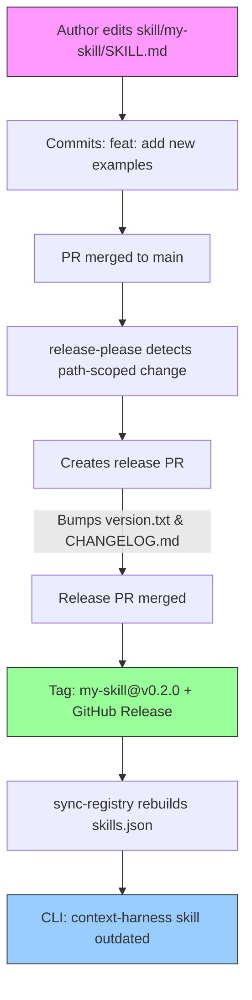

# co-labs-co/context-harness

Skills registry for [ContextHarness](https://github.com/co-labs-co/context-harness).

## ⚠️ Setup Required

After creating this repo, configure GitHub Actions permissions:

1. Go to **Settings** → **Actions** → **General**
2. Under **Workflow permissions**, select **Read and write permissions**
3. Check **Allow GitHub Actions to create and approve pull requests**

Without these settings, release-please cannot create release PRs.

## How It Works

This registry uses **fully automated semantic versioning**. Authors never touch
version numbers — just write content and use conventional commits:



## Quick Start

See [QUICKSTART.md](QUICKSTART.md) for adding your first skill.

## Configure as Your Registry

```bash
# Set for current project
context-harness config set skills-repo co-labs-co/context-harness

# Set for all projects (user-level)
context-harness config set skills-repo co-labs-co/context-harness --global
```

## Commit Convention

| Commit prefix | Version bump | Example |
|---------------|-------------|---------|
| `fix:` | Patch (0.0.x) | `fix: correct typo in examples` |
| `feat:` | Minor (0.x.0) | `feat: add error handling patterns` |
| `feat!:` | Major (x.0.0) | `feat!: restructure skill format` |
| `docs:` | No release | `docs: update readme` |
| `chore:` | No release | `chore: clean up formatting` |

## Structure

```
co-labs-co/context-harness/
├── .github/
│   └── workflows/
│       ├── release.yml           # release-please automation
│       ├── sync-registry.yml     # Rebuilds skills.json post-release
│       ├── validate-skills.yml   # PR validation checks
│       └── auto-rebase.yml       # Auto-rebase PRs when shared files change
├── scripts/
│   ├── sync-registry.py          # Parses skills → skills.json
│   └── validate_skills.py        # Pydantic-based validation
├── skill/
│   └── example-skill/
│       ├── SKILL.md              # Skill content (no version field)
│       └── version.txt           # Managed by release-please
├── skills.json                   # Auto-maintained registry manifest
├── release-please-config.json    # Per-skill release configuration
├── .release-please-manifest.json # Current versions (CI-managed)
├── CONTRIBUTING.md
├── QUICKSTART.md
└── README.md
```

## Contributing

See [CONTRIBUTING.md](CONTRIBUTING.md) for how to add or update skills.
