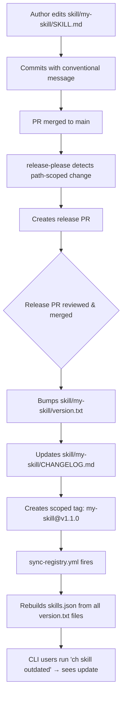

# Skills

Skills are pre-built patterns and workflows that extend the agent's capabilities.

## What are Skills?

Skills are markdown files with YAML frontmatter that provide specialized knowledge and step-by-step guidance for specific tasks. When you load a skill, the agent gains access to detailed instructions for that domain.

## Using Skills

### List Available Skills

```bash
# List all skills from the registry
ch skill list

# Filter by tag
ch skill list --tags react
ch skill list --tags python
```

### Install a Skill

```bash
# Interactive picker (recommended)
ch skill install

# Install specific skill
ch skill install react-forms
```

**Interactive picker:**

```
? Select a skill to install: (Use arrow keys, type to filter)
 » react-forms - React form handling with validation
   django-auth - Django authentication patterns
   fastapi-crud - FastAPI CRUD patterns
```

!!! info "Dual-Tool Installation"
    When both OpenCode and Claude Code are configured, skills are automatically installed to both tool directories.

### View Skill Details

```bash
ch skill info react-forms
```

### List Installed Skills

```bash
ch skill list-local
```

This command searches both `.opencode/skill/` and `.claude/skills/` directories.

## Skill Structure

Skills are stored in tool-specific directories:

=== "OpenCode"

    ```
    .opencode/skill/
    ├── react-forms/
    │   └── SKILL.md
    ├── fastapi-crud/
    │   └── SKILL.md
    └── my-custom-skill/
        └── SKILL.md
    ```

=== "Claude Code"

    ```
    .claude/skills/
    ├── react-forms/
    │   └── SKILL.md
    ├── fastapi-crud/
    │   └── SKILL.md
    └── my-custom-skill/
        └── SKILL.md
    ```

=== "Both Tools"

    When both tools are installed, skills exist in both locations:
    
    ```
    .opencode/skill/react-forms/SKILL.md
    .claude/skills/react-forms/SKILL.md
    ```

Each skill has YAML frontmatter:

```markdown
---
name: react-forms
description: React form handling with validation
tags:
  - react
  - forms
  - validation
---

# React Forms Skill

Instructions for the agent...
```

!!! warning "Version is NOT in Frontmatter"
    Skill versions are managed by release-please via `version.txt` in each skill directory (see [Automated Versioning](#automated-versioning) below). **Do not** add a `version` field to the SKILL.md frontmatter — the CI validation workflow will flag it as an error.

## Creating Custom Skills

### 1. Create the Skill File

=== "OpenCode"

    Create `.opencode/skill/my-skill/SKILL.md`:
    
    ```markdown
    ---
    name: my-skill
    description: What this skill does
    tags:
      - category
    ---
    
    # My Skill
    
    ## When to Use
    
    Use this skill when...
    
    ## Instructions
    
    1. Step one
    2. Step two
    3. Step three
    
    ## Examples
    
    ```python
    # Example code
    ```
    ```

=== "Claude Code"

    Create `.claude/skills/my-skill/SKILL.md`:
    
    ```markdown
    ---
    name: my-skill
    description: What this skill does
    tags:
      - category
    ---
    
    # My Skill
    
    ## When to Use
    
    Use this skill when...
    
    ## Instructions
    
    1. Step one
    2. Step two
    3. Step three
    
    ## Examples
    
    ```python
    # Example code
    ```
    ```

!!! warning "Do Not Add `version` to Frontmatter"
    If you plan to publish this skill to a registry with automated versioning, the `version` field must **not** appear in the frontmatter. Version is managed via `version.txt` (see [Automated Versioning](#automated-versioning)).

!!! tip "Skill Content is Identical"
    The skill file content is the same for both tools—only the directory path differs.

### 2. Extract to Share

```bash
# Interactive picker
ch skill extract

# Or specify skill name
ch skill extract my-skill
```

This generates a JSON file you can submit to a skills repository.

## Custom Skills Repository

You can host your own skills registry instead of using the default `co-labs-co/context-harness-skills` repository. This is useful for organizations that want to share private skills across teams.

### Creating a Registry Repository

The fastest way to get started is with the `init-repo` command, which creates a properly scaffolded GitHub repository:

```bash
# Create a private registry under your personal account
ch skill init-repo my-skills

# Create under an organization
ch skill init-repo my-org/team-skills

# Create a public registry
ch skill init-repo my-org/team-skills --public

# Create and configure as your default in one step
ch skill init-repo my-skills --configure-user
```

!!! note "Prerequisite"
    The GitHub CLI (`gh`) must be installed and authenticated. Run `gh auth login` if you haven't already.

The command creates a fully scaffolded repository with CI/CD automation for per-skill semantic versioning:

```
my-skills/
├── .github/
│   ├── workflows/
│   │   ├── release.yml                # release-please per-skill versioning
│   │   ├── sync-registry.yml          # Rebuilds skills.json after releases
│   │   └── validate-skills.yml        # PR validation + sticky comments
│   ├── ISSUE_TEMPLATE/
│   │   └── new-skill.md               # Template for proposing new skills
│   └── PULL_REQUEST_TEMPLATE.md       # PR checklist for contributors
├── scripts/
│   ├── sync-registry.py               # Parses frontmatter + version.txt → skills.json
│   └── validate_skills.py             # Pydantic-based schema validation
├── skill/
│   └── example-skill/
│       ├── SKILL.md                   # Example skill (no version in frontmatter)
│       └── version.txt                # Bootstrapped at 0.1.0
├── skills.json                        # Registry manifest (auto-updated by CI)
├── release-please-config.json         # release-please configuration
├── .release-please-manifest.json      # Current versions (managed by CI)
├── .gitignore
├── README.md                          # Includes Mermaid lifecycle diagram
├── CONTRIBUTING.md                    # Contributor guide with conventional commits
└── QUICKSTART.md                      # Quick-start for adding your first skill
```

!!! info "16 Files, Zero Manual Setup"
    The scaffold creates 16 files — a complete GitHub repository with CI/CD that handles versioning, validation, and registry updates automatically. You just write skill content and use conventional commits.

Once created, you can start adding skills to the repository. See [Adding Skills to Your Registry](#adding-skills-to-your-registry) below for the complete workflow.

**Auto-configuration options:**

| Flag | Effect |
|------|--------|
| `--configure-user` | Sets the new repo as your default `skills-repo` in `~/.context-harness/config.json` — applies to **all projects** on your machine |
| `--configure-project` | Sets the new repo as the project's `skills-repo` in `opencode.json` — applies to **this project only** |

If you don't use either flag, the command prints manual `config set` instructions for both scopes.

!!! tip "Which one should I use?"
    Use `--configure-user` if you want every project on your machine to pull skills from this registry by default. Use `--configure-project` if only the current project should use it. Project-level config takes precedence over user-level config (see [Configuration Precedence](#configuration-precedence) below).

### Configuration

=== "OpenCode"

    ```bash
    # Project-level (in opencode.json)
    ch config set skills-repo my-org/my-skills-repo
    
    # User-level (in ~/.context-harness/config.json)
    ch config set skills-repo my-org/my-skills-repo --user
    
    # Environment variable
    export CONTEXT_HARNESS_SKILLS_REPO=my-org/private-skills
    ```

=== "Claude Code"

    ```bash
    # Project-level (in .claude/settings.json)
    ch config set skills-repo my-org/my-skills-repo
    
    # User-level (in ~/.context-harness/config.json)
    ch config set skills-repo my-org/my-skills-repo --user
    
    # Environment variable
    export CONTEXT_HARNESS_SKILLS_REPO=my-org/private-skills
    ```

### Repository Structure

A skills registry repository follows this structure:

```
my-skills-repo/
├── .github/
│   └── workflows/
│       ├── release.yml              # Automated per-skill releases
│       ├── sync-registry.yml        # Rebuilds skills.json post-release
│       └── validate-skills.yml      # PR validation
├── scripts/
│   ├── sync-registry.py             # Registry builder script
│   └── validate_skills.py           # Validation script
├── skill/                           # All skills live here
│   ├── my-skill/
│   │   ├── SKILL.md                 # Skill content (no version in frontmatter)
│   │   └── version.txt              # Current version (managed by release-please)
│   └── another-skill/
│       ├── SKILL.md
│       └── version.txt
├── skills.json                      # Registry manifest (auto-generated)
├── release-please-config.json       # Versioning configuration
├── .release-please-manifest.json    # Version state
├── README.md
├── CONTRIBUTING.md
└── QUICKSTART.md
```

### skills.json Format

The `skills.json` file is the registry manifest that the CLI fetches to discover available skills. It is **auto-generated** by the `sync-registry.yml` workflow — do not edit it by hand.

```json
{
  "schema_version": "1.0",
  "skills": [
    {
      "name": "my-skill",
      "description": "What this skill does",
      "version": "1.2.0",
      "author": "your-username",
      "tags": ["category"],
      "path": "skill/my-skill",
      "min_context_harness_version": null,
      "content_hash": "a1b2c3d4e5f67890"
    }
  ]
}
```

| Field | Description |
|-------|-------------|
| `name` | Skill identifier (matches directory name) |
| `description` | From SKILL.md frontmatter |
| `version` | From `version.txt` (managed by release-please) |
| `author` | From SKILL.md frontmatter |
| `tags` | From SKILL.md frontmatter |
| `path` | Directory path in the repository |
| `min_context_harness_version` | From SKILL.md frontmatter (optional) |
| `content_hash` | SHA-256 prefix of SKILL.md for change detection |

## Automated Versioning

Repositories scaffolded by `ch skill init-repo` use [release-please](https://github.com/googleapis/release-please) for fully automated per-skill semantic versioning. **Authors never touch version numbers** — they write content and use conventional commits, and CI handles everything else.

### How It Works



### Conventional Commits Drive Versioning

The type of commit message determines the version bump for the affected skill:

| Commit Message | Version Bump | Example |
|----------------|--------------|---------|
| `fix: correct typo in examples` | **Patch** (1.0.0 → 1.0.1) | Bug fixes, typos |
| `feat: add error handling patterns` | **Minor** (1.0.0 → 1.1.0) | New content, sections |
| `feat!: restructure skill format` | **Major** (1.0.0 → 2.0.0) | Breaking changes |
| `docs: update readme` | **None** | Non-skill documentation |
| `chore: update CI config` | **None** | Maintenance |

!!! important "Path-Based Detection"
    release-please attributes commits to skills based on **which files they touch**, not the commit scope. If you edit `skill/react-forms/SKILL.md`, release-please knows the `react-forms` skill was changed — you don't need to specify a scope in your commit message.

### Where Version Lives

| Location | Managed By | Purpose |
|----------|-----------|---------|
| `skill/{name}/version.txt` | release-please (CI) | Source of truth per skill |
| `skill/{name}/CHANGELOG.md` | release-please (CI) | Auto-generated changelog |
| `.release-please-manifest.json` | release-please (CI) | All current versions |
| `skills.json` | sync-registry.py (CI) | Registry manifest the CLI fetches |

!!! warning "Never Edit `version.txt` or `skills.json` by Hand"
    Both are managed by CI. Manual edits will be overwritten on the next release or sync cycle.

### CI/CD Workflows

The scaffold includes three GitHub Actions workflows:

#### `release.yml` — Automated Releases

Runs on every push to `main`. Uses `googleapis/release-please-action@v4` with:

- **`release-type: "simple"`** — manages `version.txt` + `CHANGELOG.md` per skill
- **`include-component-in-tag: true`** — tags like `my-skill@v1.1.0`
- **`tag-separator: "@"`** — separates skill name from version
- **`separate-pull-requests: true`** — one release PR per skill

#### `sync-registry.yml` — Registry Updates

Fires after a release is published. Runs `scripts/sync-registry.py` to:

1. Scan all `skill/*/SKILL.md` files and parse frontmatter
2. Read `version.txt` from each skill directory
3. Compute content hashes for change detection
4. Write the consolidated `skills.json`
5. Commit with `[skip ci]` to prevent infinite loops

#### `validate-skills.yml` — PR Validation

Runs on every PR that modifies files under `skill/`. Uses `scripts/validate_skills.py` (Pydantic-based) to:

1. Check every skill has a valid `SKILL.md` with required frontmatter
2. Verify `name` field matches directory name
3. Ensure no `version` field exists in frontmatter
4. Confirm `version.txt` exists and contains a valid semver string
5. Check for duplicate skill names
6. Post a **sticky PR comment** with the validation report (updates on each push)

## Adding Skills to Your Registry

### Step 1: Create the Skill Directory

```bash
mkdir -p skill/my-new-skill
```

### Step 2: Create SKILL.md

````markdown
---
name: my-new-skill
description: Brief description of what this skill does
author: your-username
tags:
  - category
  - subcategory
---

# My New Skill

## When to Use

Use this skill when...

## Instructions

1. Step one
2. Step two

## Examples

```python
# Example code
```
````

!!! warning "No `version` Field"
    Do not include `version` in the frontmatter. It is managed by `version.txt`.

### Step 3: Create version.txt

```bash
echo "0.1.0" > skill/my-new-skill/version.txt
```

!!! important "Bootstrapping Required"
    release-please will **not** create `version.txt` for you — it only bumps an existing file. You must bootstrap it at `0.1.0` (or your preferred starting version) when creating a new skill.

### Step 4: Register with release-please

Add the skill to both release-please configuration files:

**`release-please-config.json`** — add the package entry:

```json
{
  "packages": {
    "skill/my-new-skill": {
      "release-type": "simple",
      "component": "my-new-skill"
    }
  }
}
```

**`.release-please-manifest.json`** — add the initial version:

```json
{
  "skill/my-new-skill": "0.1.0"
}
```

### Step 5: Commit and Push

Use conventional commits to drive versioning:

```bash
git add skill/my-new-skill/ release-please-config.json .release-please-manifest.json
git commit -m "feat: add my-new-skill"
git push
```

After this PR is merged, release-please will create a release PR to bump the version. When that release PR is merged, the skill gets a scoped tag (`my-new-skill@v0.1.0`) and `skills.json` is automatically updated.

## Keeping Skills Up to Date

### Check for Updates

See which of your installed skills have newer versions available:

```bash
ch skill outdated
```

**Example output:**

```
┏━━━━━━━━━━━━━━━━━┳━━━━━━━━━━━━━━━┳━━━━━━━━━━━━━━━┳━━━━━━━━━━━━━━━━━━━━━┓
┃ Skill           ┃ Installed     ┃ Latest        ┃ Status              ┃
┡━━━━━━━━━━━━━━━━━╇━━━━━━━━━━━━━━━╇━━━━━━━━━━━━━━━╇━━━━━━━━━━━━━━━━━━━━━┩
│ react-forms     │ 0.1.0         │ 0.2.0         │ upgrade available   │
│ fastapi-crud    │ 1.0.0         │ 1.0.0         │ up to date          │
└─────────────────┴───────────────┴───────────────┴─────────────────────┘
```

### Upgrade Skills

```bash
# Upgrade a single skill
ch skill upgrade react-forms

# Upgrade all outdated skills at once
ch skill upgrade --all
```

### Compatibility

Skills can declare a minimum ContextHarness version they require via `min_context_harness_version` in their metadata. If your installed version is too old, the upgrade is blocked:

```
❌ react-forms requires context-harness >= 4.0.0 (you have 3.9.0)
   Run: pipx upgrade context-harness
   Or use --force to skip this check
```

Use `--force` to bypass the check if needed:

```bash
ch skill upgrade react-forms --force
```

## Configuration Precedence

Skills repository is resolved in this order:

| Priority | Source | Location |
|----------|--------|----------|
| 1 (Highest) | Environment Variable | `CONTEXT_HARNESS_SKILLS_REPO` |
| 2 | Project Config | `opencode.json` → `skillsRegistry.default` |
| 3 | User Config | `~/.context-harness/config.json` |
| 4 (Lowest) | Default | Official skills repository |
